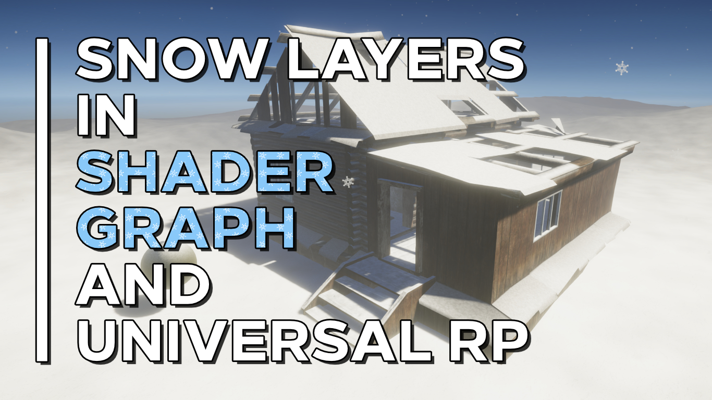

# Snow Layers in Unity Shader Graph

A snow layer shader for Shader Graph and Universal Render Pipeline in which the snow builds up over time.

## Overview

Snow levels are a mainstay of videogame culture. This shader can be used to layer snow over existing surfaces in your game by specifying a snow direction and other properties that influence the speed of snow buildup and the strength of texture variation on the snow surface.

## Software

This project was created using Unity 2020.2.1f1 and Universal Render Pipeline 10.2.2.

## Authors

This project and the corresponding tutorial was created by Daniel Ilett.

## Release

This project was publically released on March 25th 2021.
